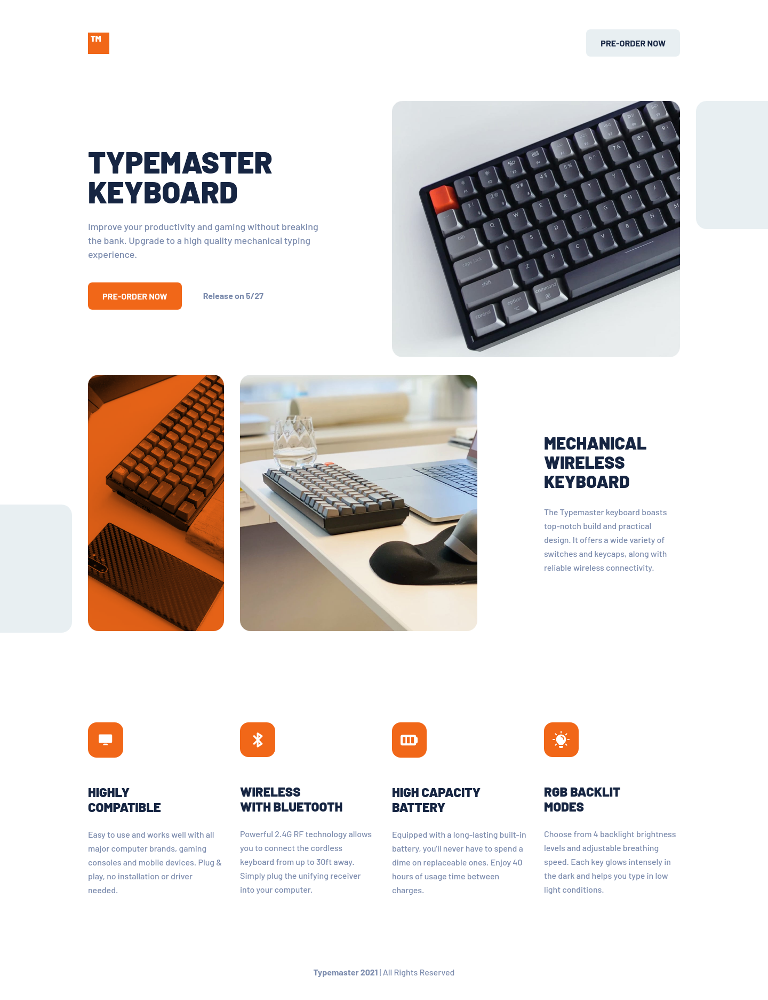
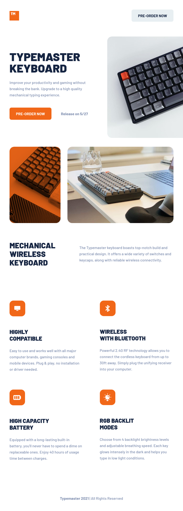
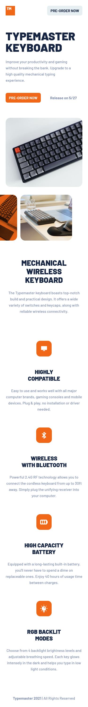

# Typemaster pre-launch landing page

## Table of contents

- [Typemaster pre-launch landing page](#typemaster-pre-launch-landing-page)
  - [Table of contents](#table-of-contents)
  - [Overview](#overview)
    - [Summary](#summary)
    - [Links](#links)
    - [Screenshot](#screenshot)
      - [Desktop](#desktop)
      - [Tablet](#tablet)
      - [Mobile](#mobile)
  - [Details](#details)
    - [Web stack and explanation](#web-stack-and-explanation)
    - [Problem and thought process](#problem-and-thought-process)
    - [Useful resources](#useful-resources)
  - [Author](#author)

## Overview

### Summary

A beautiful product landing page built with HTML and SCSS along with modern CSS practices.

### Links

- Solution URL: [GitHub](https://github.com/hooiyan/fem-typemaster-pre-launch-landing-page)
- Live Site URL: [Netlify](https://hy-typemaster.netlify.app/)

### Screenshot

#### Desktop

#### Tablet

#### Mobile

## Details

### Web stack and explanation

- BEM naming convention
- SCSS
- Flexbox
- CSS Grid
- Desktop-first workflow

### Problem and thought process

1. At first, I was planning to build the layout with only CSS Grid as suggested in the challenge details. But I only used that for the last section with the four logos.
2. I was also struggling with `overflow:hidden` that didn't work, I still am, that's why I styled the first keyboard image a bit differently. 
3. There is one picture with an orange overlay I didn't get it to work like the original design. I wanted to give up trying after a few times, because `opacity` didn't work out as the effect I want, and setting the `background-color`'s alpha channel didn't work as well. Later, I decided to take a look at the code snippet section we have in Figma. I saw a `mix-blend-mode` property was used and I tried that out and I think the color looks much prettier with this property.
4. About the responsiveness of this challenge, I believe there must be a better way of doing it, my way is more of a brute-force style. I used absolute positioning for the images and set different breakpoints to have different sizes.

### Useful resources

- [Why does position absolute make page to overflow?](https://newbedev.com/why-does-position-absolute-make-page-to-overflow) - This helped me for understanding why overflow does not work as we expected.
- [When importing a file with @use then: Error Undefined Mixin](https://stackoverflow.com/questions/66365150/when-importing-a-file-with-use-then-error-undefined-mixin) - This is the exact question that I asked on Google as I received the same error message when I couldn't get to use the mixins that I have defined in `_mixins.scss`. Therefore, I have to import like so: `@use 'mixins as *`.

## Author

- Website - [hooiyan](https://hooiyan.netlify.app)
- Frontend Mentor - [@hooiyan](https://www.frontendmentor.io/profile/hooiyan)
